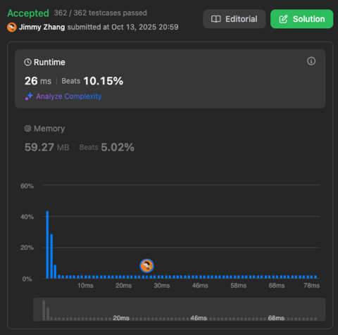
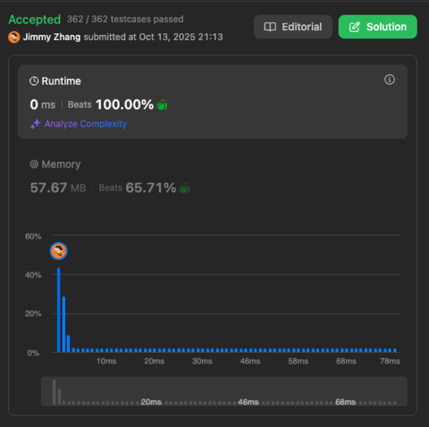

# Remove Duplicates from Sorted Array

Given an integer array nums sorted in non-decreasing order, remove the duplicates [in-place](https://en.wikipedia.org/wiki/In-place_algorithm) such that each unique element appears only once. The relative order of the elements should be kept the same. Then return the number of unique elements in nums.  
  
Consider the number of unique elements of nums to be k, to get accepted, you need to do the following things:  
  
- Change the array nums such that the first k elements of nums contain the unique elements in the order they were present in nums initially. 
- The remaining elements of nums are not important as well as the size of nums.
Return k.
  
Custom Judge:  

The judge will test your solution with the following code:
```
int[] nums = [...]; // Input array
int[] expectedNums = [...]; // The expected answer with correct length

int k = removeDuplicates(nums); // Calls your implementation

assert k == expectedNums.length;
for (int i = 0; i < k; i++) {
    assert nums[i] == expectedNums[i];
}
```
If all assertions pass, then your solution will be accepted.  
  
  
  
Example 1:
```
Input: nums = [1,1,2]
Output: 2, nums = [1,2,_]
Explanation: Your function should return k = 2, with the first two elements of nums being 1 and 2 respectively.
It does not matter what you leave beyond the returned k (hence they are underscores).
```
Example 2:
```
Input: nums = [0,0,1,1,1,2,2,3,3,4]
Output: 5, nums = [0,1,2,3,4,_,_,_,_,_]
Explanation: Your function should return k = 5, with the first five elements of nums being 0, 1, 2, 3, and 4 respectively.
It does not matter what you leave beyond the returned k (hence they are underscores).
```

Constraints:
```
1 <= nums.length <= 3 * 104
-100 <= nums[i] <= 100
nums is sorted in non-decreasing order.
```

Leetcode Link: 
https://leetcode.com/problems/remove-duplicates-from-sorted-array/description/

## Solutions

### Solution 1
```
/**
 * @param {number[]} nums
 * @return {number}
 */
var removeDuplicates = function(nums) {
    for (let i = 1; i < nums.length; i++) {
        if (nums[i] === '_') {
            return i;
        }
        if (nums[i] == nums[i-1]) {
            nums.splice(i, 1); // remove this duplicate item
            nums.push('_'); // push _ into the end to maintain the length)
            i--; // since the next item move forward, we need let i go back 1 position
        } 
    }
};
```


### Solution 2
```
/**
 * @param {number[]} nums
 * @return {number}
 */
var removeDuplicates = function(nums) {
    let k = 0; // k is the non-dup pointer
    for (let i = 1; i < nums.length; i++) {
        if (nums[i] == nums[k]) {
            nums[i] = '_';
        } else {
            k++;
            nums[k] = nums[i];
            if (i > k) nums[i] = '_';
        }
        //console.log(nums);
    }
    console.log(nums, k);
    return k+1;
};
```



Since there is a console.log output in the solution code, it is not the best Runtime  

removed the console.log version:
```
/**
 * @param {number[]} nums
 * @return {number}
 */
var removeDuplicates = function(nums) {
    let k = 0; // k is the non-dup pointer
    for (let i = 1; i < nums.length; i++) {
        if (nums[i] == nums[k]) {
            nums[i] = '_';
        } else {
            k++;
            nums[k] = nums[i];
            if (i > k) nums[i] = '_';
        }
        //console.log(nums);
    }
    //console.log(nums, k);
    return k+1;
};
```
