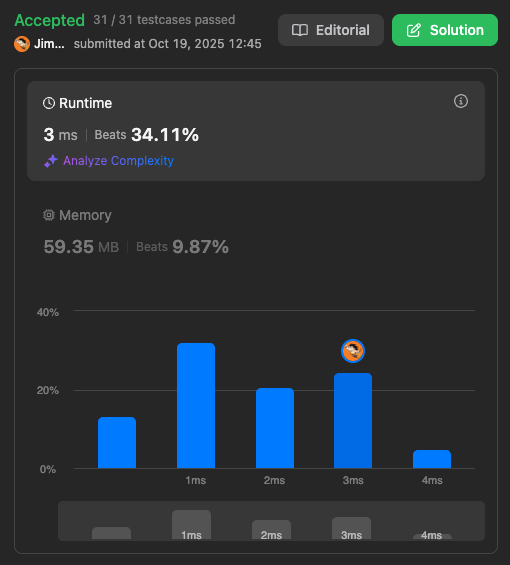

# Convert Sorted Array to Binary Search Tree

Given an integer array nums where the elements are sorted in ascending order, convert it to a height-balanced binary search tree.

Example 1:


```
Input: nums = [-10,-3,0,5,9]
Output: [0,-3,9,-10,null,5]
Explanation: [0,-10,5,null,-3,null,9] is also accepted:
```
Example 2:


```
Input: nums = [1,3]
Output: [3,1]
Explanation: [1,null,3] and [3,1] are both height-balanced BSTs.
```

Constraints:
```
1 <= nums.length <= 104
-104 <= nums[i] <= 104
nums is sorted in a strictly increasing order.
```

# Solutions

## Solution 1

```
/**
 * Definition for a binary tree node.
 * function TreeNode(val, left, right) {
 *     this.val = (val===undefined ? 0 : val)
 *     this.left = (left===undefined ? null : left)
 *     this.right = (right===undefined ? null : right)
 * }
 */
/**
 * @param {number[]} nums
 * @return {TreeNode}
 */
var sortedArrayToBST = function(nums) {
    function TreeNode(val, left, right) {
        this.val = (val===undefined ? 0 : val)
        this.left = (left===undefined ? null : left)
        this.right = (right===undefined ? null : right)
    }

    const build = (start, end) => {
        if (start === end) return null;
        const mid = Math.floor((start + end) / 2);
        const node = new TreeNode(
            nums[mid], 
            build(start, mid),
            build(mid+1, end)
            );
        return node;
    }
    return build(0, nums.length);
};
```

