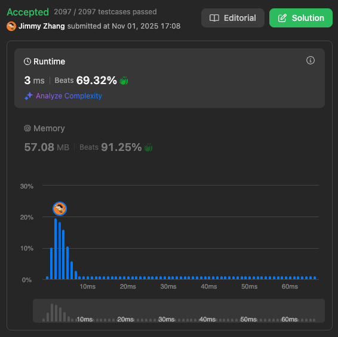

# Median of Two Sorted Arrays

Given two sorted arrays nums1 and nums2 of size m and n respectively, return the median of the two sorted arrays.  

The overall run time complexity should be O(log (m+n)).  
(two pointer)
 

Example 1:
```
Input: nums1 = [1,3], nums2 = [2]
Output: 2.00000
Explanation: merged array = [1,2,3] and median is 2.
```
Example 2:
```
Input: nums1 = [1,2], nums2 = [3,4]
Output: 2.50000
Explanation: merged array = [1,2,3,4] and median is (2 + 3) / 2 = 2.5.
```

Constraints:
```
nums1.length == m
nums2.length == n
0 <= m <= 1000
0 <= n <= 1000
1 <= m + n <= 2000
-106 <= nums1[i], nums2[i] <= 106
```

Leetcode Link: https://leetcode.com/problems/median-of-two-sorted-arrays

# Solution

```
/**
 * @param {number[]} nums1
 * @param {number[]} nums2
 * @return {number}
 */
var findMedianSortedArrays = function(nums1, nums2) {
    const totalLength = nums1.length + nums2.length;
    const maxi = Math.floor(totalLength/2); // the max pointer for nums
    let nums = [];
    if (nums1.length === 0) {
        nums = nums2;
    } else if (nums2.length == 0) {
        nums = nums1;
    } else {
        let i = 0; // nums pointer
        let j = 0; // nums1 pointer
        let k = 0; // nums2 pointer
        for (; i <= maxi; i++ ) {
            if (nums1[j] < nums2[k]) {
                // put the small one to nums
                nums[i] = nums1[j];
                j++;
                if (j === nums1.length) {
                    nums = nums.concat(nums2.slice(k));
                    break;
                }
            } else {
                nums[i] = nums2[k];
                k++;
                if (k === nums2.length) {
                    nums = nums.concat(nums1.slice(j));
                    break;
                }
            }
        }
        //console.log(nums, maxi, totalLength);
    }
    
    
    if (totalLength%2 === 0) {
        return (nums[maxi] + nums[maxi-1])/2;
    } else {
        return nums[maxi];
    }
};
```

