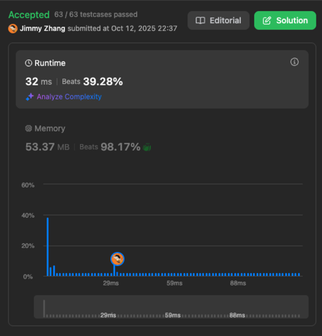

# Two Sum

## problem

Given an array of integers nums and an integer target, return indices of the two numbers such that they add up to target.  
  

You may assume that each input would have exactly one solution, and you may not use the same element twice.  
  
You can return the answer in any order.  

Example 1:
```
Input: nums = [2,7,11,15], target = 9
Output: [0,1]

Explanation: Because nums[0] + nums[1] == 9, we return [0, 1].
```

Example 2:
```
Input: nums = [3,2,4], target = 6
Output: [1,2]
```

Example 3:
```
Input: nums = [3,3], target = 6
Output: [0,1]
```

Constraints:
```
2 <= nums.length <= 104
-109 <= nums[i] <= 109
-109 <= target <= 109
Only one valid answer exists.
```

Problem link on Leetcode: [Two Sum](https://leetcode.com/problems/two-sum/)

## solutions

### solution 1
```
/**
 * @param {number[]} nums
 * @param {number} target
 * @return {number[]}
 */
var twoSum = function(nums, target) {
    for (let i = 0; i < nums.length; i++) {
        let diff = target - nums[i];
        for (let k = i+1; k < nums.length; k++) {
            if (nums[k] == diff) {
                return [i, k];
            }
        }
    }
    return null;
};
```

result and complexity:


### solution 2
```
/**
 * @param {number[]} nums
 * @param {number} target
 * @return {number[]}
 */
var twoSum = function(nums, target) {
    // first, we build a new object empty
    // then we check the next value of nums array 
    // if the diff in obj, we return the value
    // if not, we keep the nums[i] into the new obj
    // the index is obj value, and the value of array is the obj key
    // this is a O(n) algorithm 

    const numsObj = {};

    for (let i = 0; i < nums.length; i++) {
        if (numsObj[target - nums[i]]!== undefined) {
            return [i, numsObj[target - nums[i]]];
        }
        numsObj[nums[i]] = i;
    }
    return null;

};
```
  
result and complexity:
